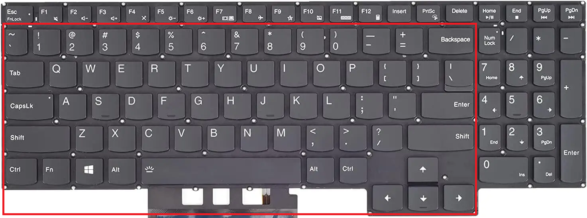
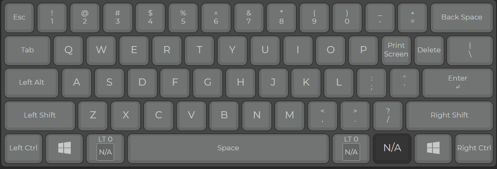
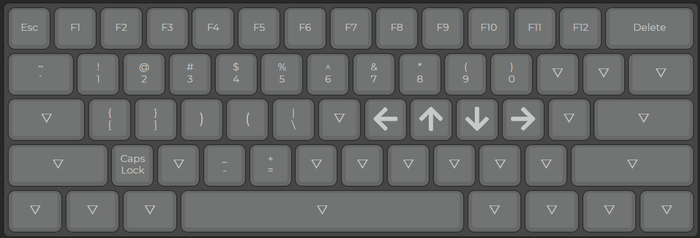

# AHKdotfiles
### As the name suggests, a AutoHotkey script tailored for an optimal typing experience in general (and coding in particular).

The script is currently utilizing only basic keys of a typical 60% keyboard, so it can adapt to basically any type of keyboard out there that do not have any VIA/QMK/firmware support (let's be real, if your keyboard has a driver firmware you'd use it anyway instead of AHK), regardless of the size (60%, 68%, TKL, etc). I'm currently using this script only when I'm not having my external keyboard around - it's quite handy if you ask me. 

  
   
  <em>The script focuses heavily on keys within the highlighted area, effectively turning the Lenovo Legion’s full-size keyboard into a 60% layout while still maintaining full functionality.</em>

---

### Contents

- [Features](#my-current-script-has-2-layouts-as-the-main-feature)
- [Illustrations](#these-images-illustrate-the-lenovo-legion-keyboard-after-applying-the-script-using-a-generic-60-layout-arrow-keys-arent-shown)
- [Implementing the script](#how-to-use-my-script)
- [Issues](#known-issuesfuture-development)
- [Afterwords](#afterwords)
___ 
### My current script has 2 layouts as the main feature:

1. Basic QWERTY layout:
  - \` key replaced with ESC, aimed to trim the whole F row. 
  - `CAPS` key replaced with `ALT`.
  - `[` and `]` are remapped with PrintScreen and Delete perspectively. 
  - Tap dance for `"` so that upon pressing the key twice, it'd print out `""` and move the cursor between the double quotes, which makes it more convenient for the user. 
  - Holding `LAlt` or `RAlt` toggles the alternative layout.
 
2. Alternative layout:
	- Replaced the number row keys (from `1` to `+`) with function keys from `F1` to `F12`.
	- Replaced the top row keys (from `Q` to `P`) with numbers from `1` to `0`.
	- `a` and `s` keys would act as `[` and `]`, respectively.
	    *- With `Shift`, they print `{` and `}` 
	- `f` and `d` outputs `(` and `)`
		*- Tap dance for `f` so that when pressed twice, it'd print `()` and move the cursor  inside the parentheses.
	- `g` would print out `\`
		*- With `Shift`, it'd print `|`
	- `Left` is Volume Down, `Down` is Mute/Unmute and `Right` is Volume Up.
---
### These images illustrate the Lenovo Legion keyboard after applying the script, using a generic 60% layout (arrow keys aren't shown):

  
   
  <em>Main QWERTY layout (layout 1)</em>

  
   
  <em>Alternative layout (layout 2)</em>

---
### How to use my script: 

1. Firstly, you'd need to install AHK (v1) on your Windows machine via the [official site](https://www.autohotkey.com/)
2. Acqure the script, either via copy or just a simple git clone.
3. Run the script. 
---
### Known issues/Future development:
~~- There seems to be a problem with the `Alt + Shift + a` combo, which can't properly produce `{`
	- Also, tap dance with the combo is quite clunky ATM~~ the whole `Alt + a` is really clunky, but not `Alt + s`, idk why.
- There's still room for other keys that aren't mentioned (PgUp, PgDown, Home, End, etc).
---
### Afterwords:
This is just my personal AHK script that aims to improve ***my*** typing experience, but if it happends to be helpful to you too - that's great!

Feel free to fork the project, make changes, and open a pull request.
